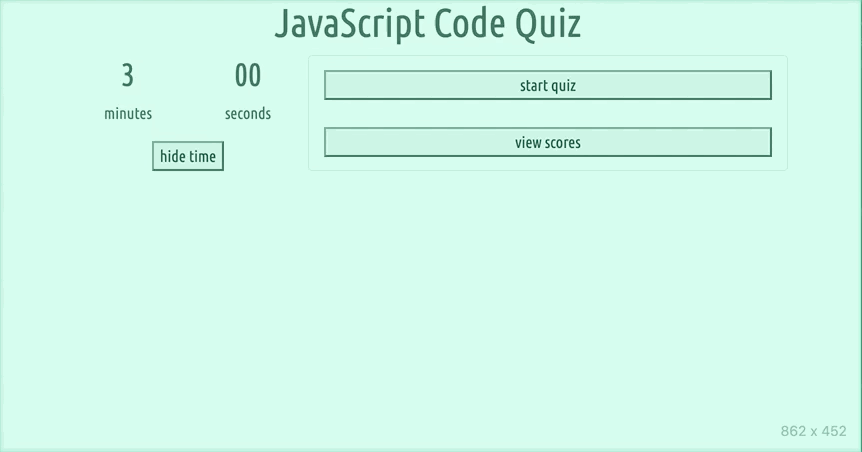

# Javascript Quiz Application

## Description

This is a web app designed to test a user's knowledge of Javascript. When the page loads, they are presented with options to start the quiz or view previous scores. 

When they start the quiz, a question is generated along with multiple choices for answers. Their score, which is updated whenever they answer a question correctly, is displayed below the time.

When a correct answer is selected, their score is increased and they are presented with a new question. When an incorrect answer is selected, it is marked as such, the possible points for the question are reduced and 5 seconds are subtracted from the remaining time. 

When time runs out or they make it through all of the questions, they are presented with their final score and asked to enter their name. Their name and score is stored in local storage and can be viewed along with previously stored names and scores.

